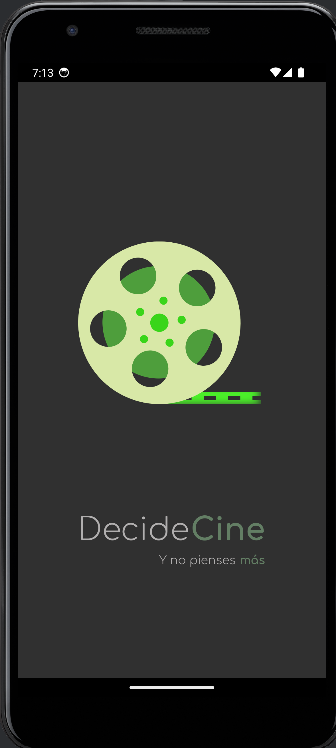
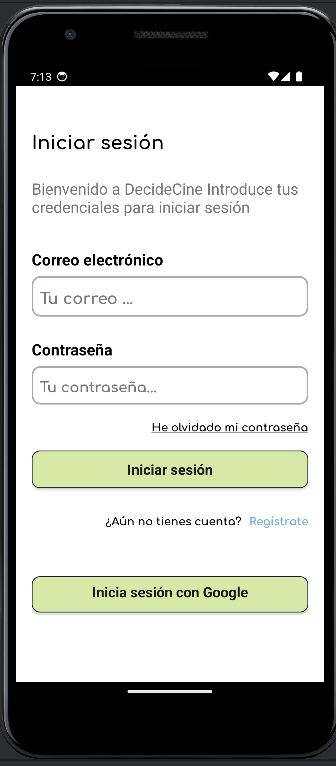
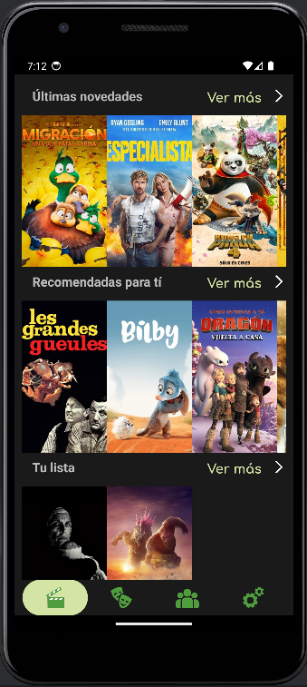
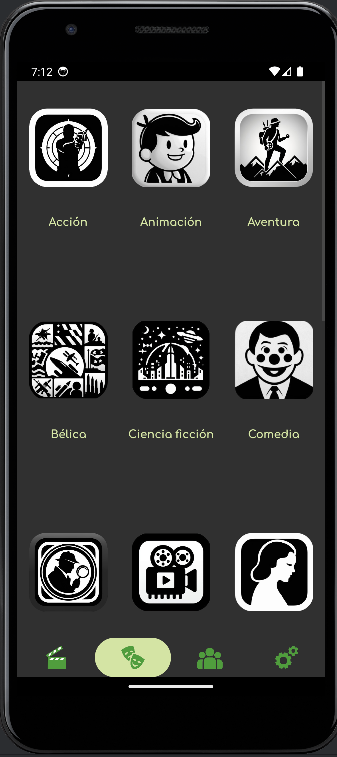

<!DOCTYPE html>
<html>
<head>
    <title>README</title>
</head>
<body>
    <h1>README</h1>

    <h2>Tabla de Contenidos</h2>
    <ol>
        <li><a href="#introduccion">Introducción</a></li>
        <li><a href="#caracteristicas">Características</a></li>
        <li><a href="#comenzando">Comenzando</a></li>
        <li><a href="#dependencias">Dependencias</a></li>
        <li><a href="#capturas">Capturas de pantalla</a></li>
        <li><a href="#analisis">Análisis de código</a></li>
        <li><a href="#instalacion">Instalación desde Android Studio</a></li>
        <li><a href="#instalacion-apk">Instalación desde APK</a></li>
    </ol>

    <h2 id="introduccion">Introducción</h2>
    
QueVemosHoy es una aplicación Android que proporciona recomendaciones de películas basadas en las preferencias del usuario. Permite a los usuarios gestionar sus preferencias de género y proveedor, ver una lista de películas recomendadas y más recientes, y añadir películas favoritas a una lista personal.

    <h2 id="caracteristicas">Características</h2>
    <ul>
        <li>Gestión de Usuarios: Los usuarios pueden añadir y eliminar usuarios, y editar las preferencias de los usuarios.</li>
        <li>Recomendaciones de Películas: La aplicación recomienda películas basadas en las preferencias de género y proveedor del usuario.</li>
        <li>Películas Favoritas: Los usuarios pueden añadir películas a una lista personal de favoritos.</li>
        <li>Películas Recientes: Los usuarios pueden ver una lista de las películas más recientes.</li>
        <li>Preferencias de Género: Los usuarios pueden gestionar sus preferencias de género.</li>
        <li>Preferencias de Proveedor: Los usuarios pueden gestionar sus preferencias de proveedor.</li>
    </ul>

    <h2 id="comenzando">Comenzando</h2>
    
Para empezar con QueVemosHoy, clona el repositorio y abre el proyecto en Android Studio. Ejecuta la aplicación en un emulador o en un dispositivo físico.

    <h2 id="dependencias">Dependencias</h2>
    <ul>
        <li>Autenticación de Firebase</li>
        <li>Base de datos en tiempo real de Firebase</li>
        <li>Retrofit</li>
        <li>Glide</li>
    </ul>

    <h2 id="capturas">Capturas de pantalla</h2>
    
    
    
    
    

    <h2 id="instalacion">Instalación desde Android Studio</h2>
    
Lo primero es clonar el repositorio y tenerlo en tu android Studio. Una vez lo tengas clonado, podrás conectar un dispositivo. Asegúrate de tener las opciones de desarrollador activadas (cada dispositivo tiene su método de activarlas, puedes consultar cómo hacerlo fácilmente en internet) y el modo de depuración en tu dispositivo antes de conectarlo por USB a tu PC.

    <h2 id="instalacion-apk">Instalación desde APK</h2>
    
Para poder realizar la instalación desde el APK, dependiendo de la versión de Android que tengas, deberás dar permisos para poder instalarlo, ya sea en el momento de su instalación o previamente.

</body>
</html>
