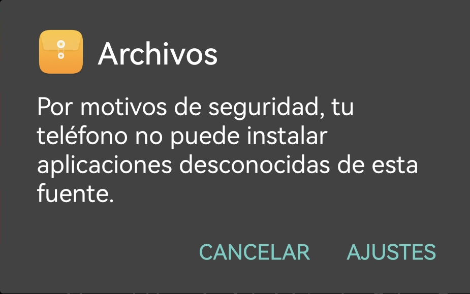
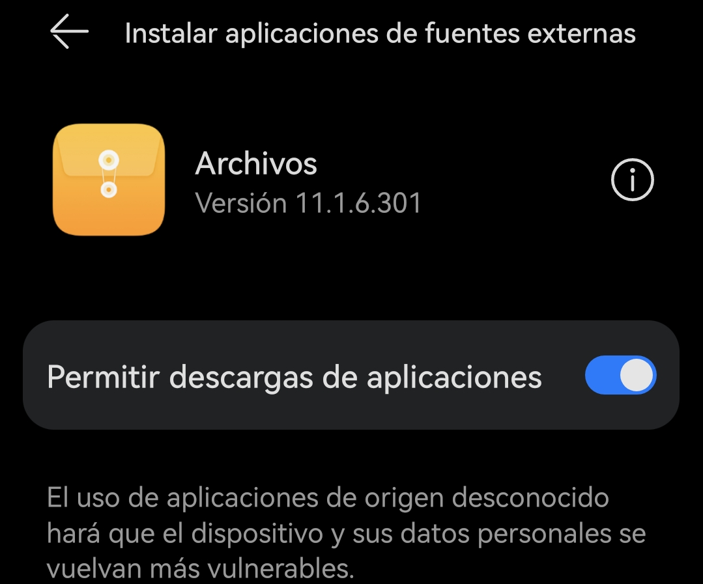
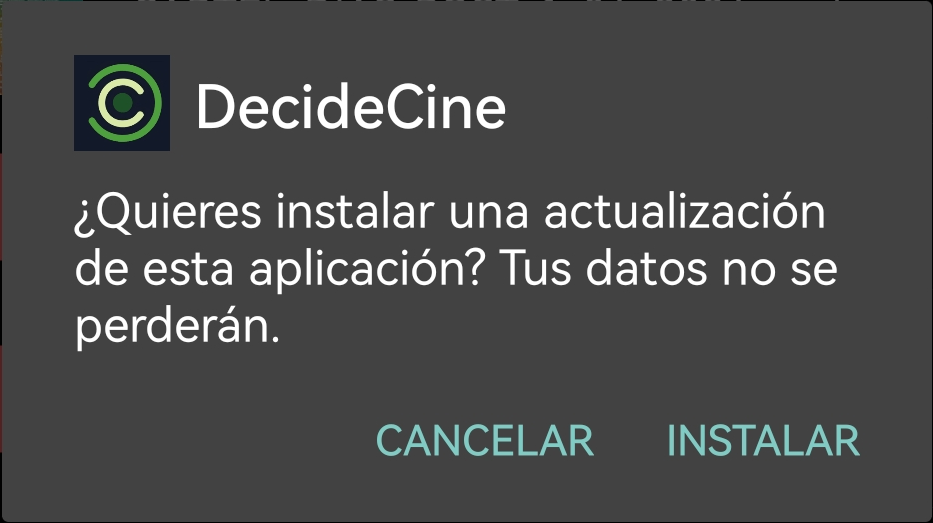
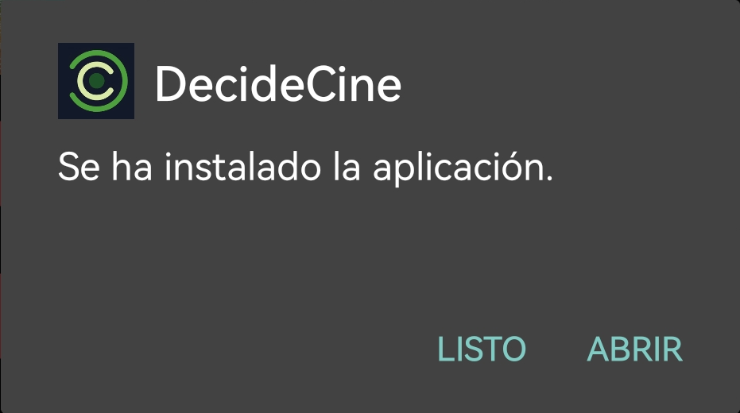

# README 

## Tabla de Contenidos
1. Introducción
2. Características
3. Comenzando
4. Dependencias
5. Capturas de pantalla
6. Análisis de código
7. Instalación desde Android Studio
8. Instalación desde APK

## Introducción
QueVemosHoy es una aplicación Android que proporciona recomendaciones de películas basadas en las preferencias del usuario. Permite a los usuarios gestionar sus preferencias de género y proveedor, ver una lista de películas recomendadas y más recientes, y añadir películas favoritas a una lista personal.

## Características
- **Gestión de Usuarios**: Los usuarios pueden añadir y eliminar usuarios, y editar las preferencias de los usuarios.
- **Recomendaciones de Películas**: La aplicación recomienda películas basadas en las preferencias de género y proveedor del usuario.
- **Películas Favoritas**: Los usuarios pueden añadir películas a una lista personal de favoritos.
- **Películas Recientes**: Los usuarios pueden ver una lista de las películas más recientes.
- **Preferencias de Género**: Los usuarios pueden gestionar sus preferencias de género.
- **Preferencias de Proveedor**: Los usuarios pueden gestionar sus preferencias de proveedor.

## Comenzando
Para empezar con QueVemosHoy, clona el repositorio y abre el proyecto en Android Studio. Ejecuta la aplicación en un emulador o en un dispositivo físico.

## Dependencias
- Autenticación de Firebase
- Base de datos en tiempo real de Firebase
- Retrofit
- Glide

## Capturas de pantalla

# README 

## Tabla de Contenidos
1. Introducción
2. Características
3. Comenzando
4. Dependencias
5. Capturas de pantalla
6. Análisis de código
7. Instalación

## Introducción
QueVemosHoy es una aplicación Android que proporciona recomendaciones de películas basadas en las preferencias del usuario. Permite a los usuarios gestionar sus preferencias de género y proveedor, ver una lista de películas recomendadas y más recientes, y añadir películas favoritas a una lista personal.

## Características
- **Gestión de Usuarios**: Los usuarios pueden añadir y eliminar usuarios, y editar las preferencias de los usuarios.
- **Recomendaciones de Películas**: La aplicación recomienda películas basadas en las preferencias de género y proveedor del usuario.
- **Películas Favoritas**: Los usuarios pueden añadir películas a una lista personal de favoritos.
- **Películas Recientes**: Los usuarios pueden ver una lista de las películas más recientes.
- **Preferencias de Género**: Los usuarios pueden gestionar sus preferencias de género.
- **Preferencias de Proveedor**: Los usuarios pueden gestionar sus preferencias de proveedor.

## Comenzando
Para empezar con QueVemosHoy, clona el repositorio y abre el proyecto en Android Studio. Ejecuta la aplicación en un emulador o en un dispositivo físico.

## Dependencias
- Autenticación de Firebase
- Base de datos en tiempo real de Firebase
- Retrofit
- Glide

## Capturas de pantalla

 ## Instalación desde Android Studio
 -Lo primero es clonar el repositorio y tenerlo en tu android Studio
Una vez lo tengas clonado, podrás conectar un dispositivo.
 -Asegúrate de tener las opciones de desarrollador activadas (cada dispositivo tiene su método de activarlas, puedes consultar cómo hacerlo fácilmente en internet)y el modo depuración en tu dispositivo antes de conectarlo por USB a tu PC.
 ----(pantallazo modo depuración)

 Cuando lo conectes, estando tu proyecto abierto en Android Studio, en tu dispositivo, te pedirá que des acceso al dispositivo, aceptalos.
 Si todo ha ido de forma correcta, aparecerá tu modelo, donde antes estaba el dispositivo virtualizado

 ----(pantallazo del nombre del dispositivo antes y después)
 Simplemente presiona play en Android Studio y espera a que se instale.
 Algunos dispositivos quizás requieran que les otorgues ciertos permisos adicionales en ese momento.

## Instalación desde APK
-Para poder realizar la instalación desde el APK, dependiendo de la versión de Android que tengas, deberás dar permisos para poder instalarlo, o en el momento de su instalación.
Versiones de Android inferiores a 8.0
Deberás habilitar en tus ajustes/seguridad, la instalación de origenes desconocidos.

Versiones de Android superiores a 8.0
En el momento de la instalación, se te pedirá otorogar permisos de instalación al sistema.

Ene ste momento se lo damos.

En este punto se nos preguntará si queremos instalarlo.

Y ya estaria instalado.

 
 
